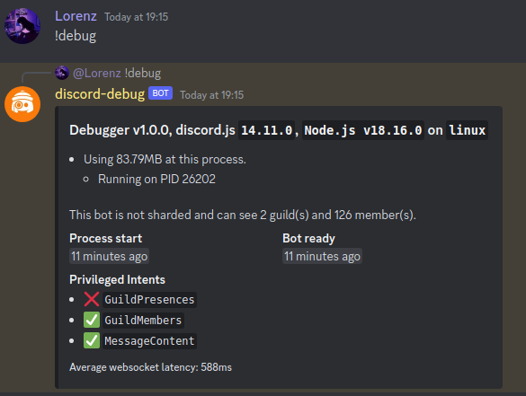
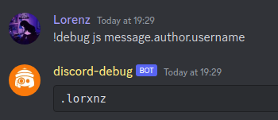

# Discord.js Debugging Tool

> Inspired by [wonderlandpark/dokdo](https://github.com/wonderlandpark/dokdo), `discord-debug` is efficient, customizable, simple and consistent!

> All credits go to [wonderlandpark/dokdo](https://github.com/wonderlandpark/dokdo)

---

## ✅ Installation

```bash
npm i discord-debug@latest
```

-   Core Dependencies
    > ```bash
    > npm i discord.js@latest
    > ```

---

## ⚙️ Basic Usage

```js
const { Client, GatewayIntentBits } = require('discord.js');
const { Debugger } = require('discord-debug');

const client = new Client({
    intents: [
        GatewayIntentBits.Guilds,
        GatewayIntentBits.GuildMessages,
        GatewayIntentBits.GuildMembers,
        GatewayIntentBits.MessageContent
    ]
});

const debug = new Debugger(client, {
    secrets: [], // not required, defaults to client's token
    owners: [] // not required, defaults to application owner(s)
});

client.on('ready', () => console.log(`Logged in as ${client.user.tag}`));

client.on('messageCreate', async (message) => {
    if (message.content === '!ping') {
        return message.reply('pong!');
    } else if (message.content.startsWith('!debug')) {
        // handle *in* prefix commands!
        const args = message.content.split(' ').slice(1);
        await debug.run(message, args);
    }
});

client.login('token');
```

---

## 📜 Debug Commands Help

-   Default:


-   Custom:
    > `discord-debug` comes with an exported **`commands`** collection of all commands.

```js
const { EmbedBuilder } = require('discord.js');
const { commands } = require('discord-debug');

const helpEmbed = new EmbedBuilder().setTitle('Help').setFields(
    commands.map((data, name) => {
        return {
            name,
            value: `${data.description}\n${data.aliases.join('') ?? ''}`,
            inline: true
        };
    })
);
```

---

## ⚡️ Features

-   ### `main`

    Shows the main debug information

    

-   ### `curl`

    Curl hyper links

    

-   ### `js` (_`javascript`, `eval`_)

    Evaluates a javascript code

    

-   ### `jsi` (_`type`_)

    Evaluates a javascript code and shows it's inspected type

    

-   ### `owners [add|remove] [id]`

    List/Add/Remove the owners of the bot

    

-   ### `shard`
    Evaluates a javascript code on all shards, and the current shard
-   ### `shell` (_`exec`, `sh`, `bash`_)

    Executes a shell command

    

-   ### `source` (_`cat`, `file`_)

    Shows the source code of a file

    

---

## 📃 Notes

-   This repository is inspired by [wonderlandpark/dokdo](https://github.com/wonderlandpark/dokdo). All credits goes to dokdo.
-   Please make sure to star dokdo before you star this repository!

-   This repository will receive its own features, may it be in dokdo or not.

---

## 💫 Contributing

**NOTE**: Create an [issue](https://github.com/Dqrshan/discord-debug/issues) before creating a pull request!

1. [Fork](https://github.com/Dqrshan/discord-debug/fork) this repository.
2. Create a [PR](https://github.com/Dqrshan/discord-debug/pulls).

---

## 🌐 Developer Contact

> https://darshan.studio/

---

#### Thanks for using `discord-debug` 💓
